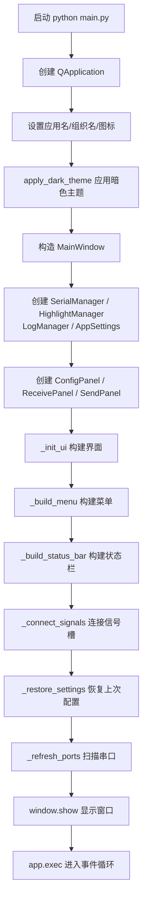
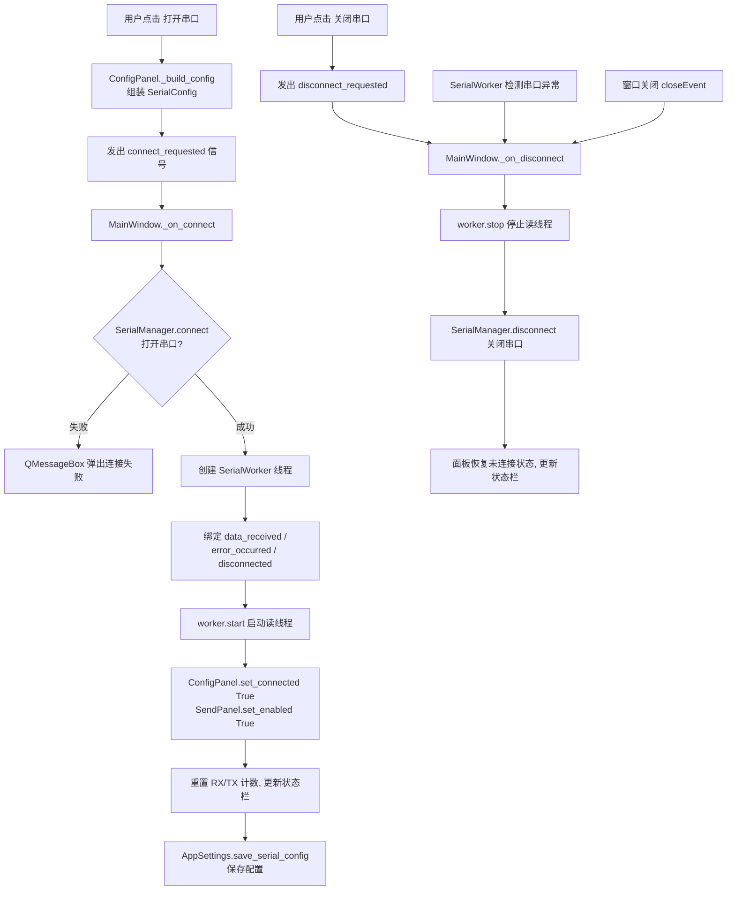
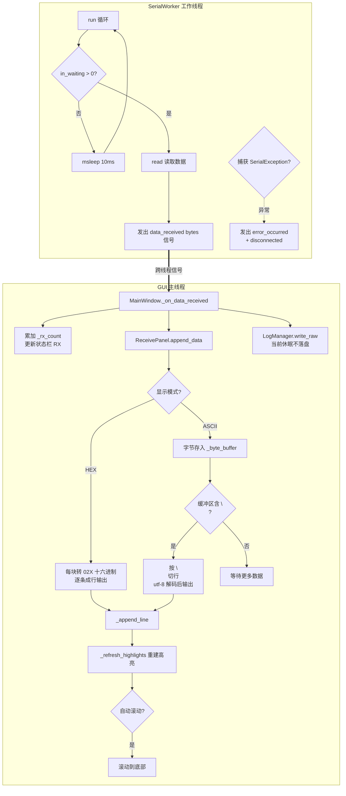
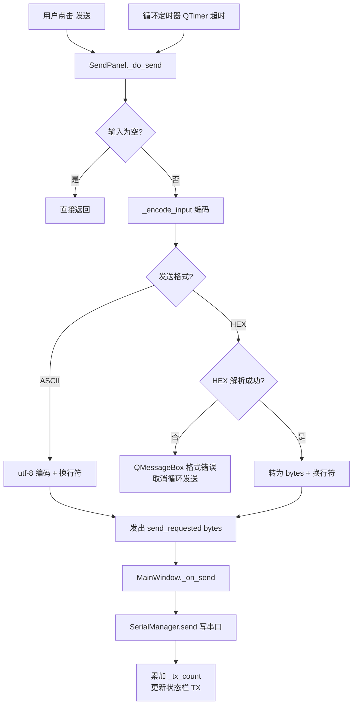
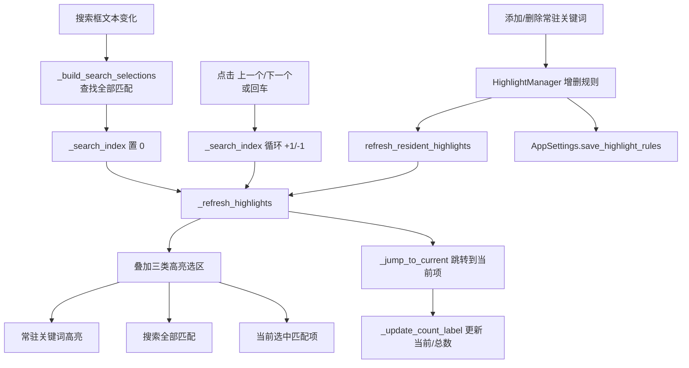
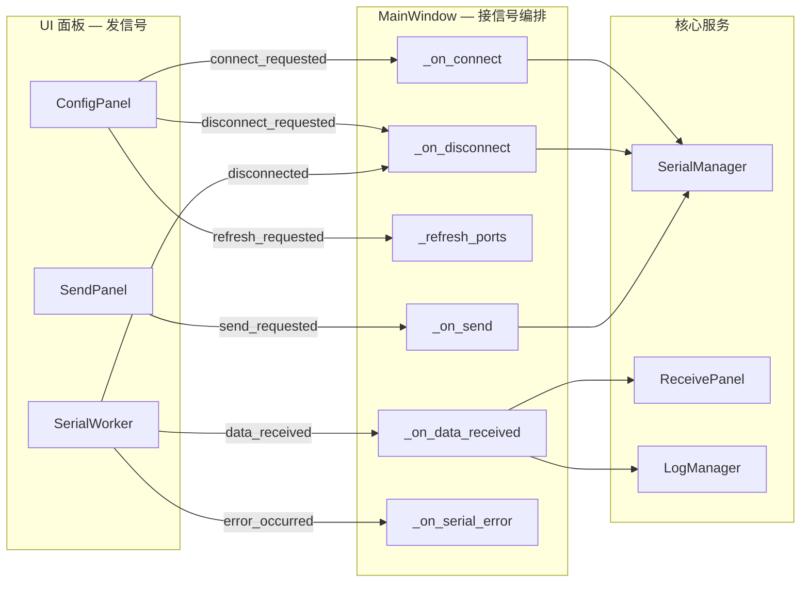

# 程序流程图

本文件用 [Mermaid](https://mermaid.js.org/) 描述串口调试工具的关键流程。
GitHub、VS Code（带 Mermaid 插件）等可直接渲染。

## 1. 应用启动流程

## 2. 串口连接 / 断开流程

## 3. 数据接收流程（跨线程）

## 4. 数据发送流程

## 5. 搜索与高亮流程

## 6. 信号与槽连接关系

